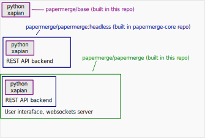

# Papermerge Docker Images

This repository builds folloging docker images:

	1. [papermerge/base](https://hub.docker.com/r/papermerge/base)
	2. [papermerge/papermerge](https://hub.docker.com/r/papermerge/papermerge)

## Papermerge/base Docker Image

papermerge/base docker image includes [Xapian](https://xapian.org/). It is the base
for all other docker images.

## Papermerge/papermerge Headless Docker Image

Headless in this context means - without user interface.

papermerge/papermerge:<version>-headless docker image is build with [papermerge/papermerge-core](https://github.com/papermerge/papermerge-core/blob/master/docker/prod/Dockerfile); in other words, headless docker image is build
in papermerge-core repository - not here!

## Papermerge/papermerge Docker Image

In this repository, based on headless docker image, the final docker image is build: papermerge/papermerge:<version>.

Final docker image includes:

- restapi backend
- frontend assets
- websockets server
- local redis instance (dependency of django-channels)

